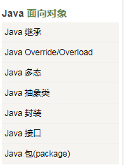

# Java 笔试面试题小结
1. Java语言不使用指针，而是引用

2. Java语言是一个纯的面向对象程序设计语言

   只支持类之间的单继承，但支持接口之间的多继承，并支持类与接口之间的实现机制（关键字为implements）。Java语言全面支持动态绑定，而C++语言只对虚函数使用动态绑定。

   

   java的主要特性有：简单的，面向对象的，分布式的，健壮的，安全的，体系结构中立的，可移植的，解释型的，高性能的，多线程的，动态的。

3. Java基础语法

   一个Java程序可以认为是一系列对象的集合，而这些对象通过调用彼此的方法来协同工作。

   对象：对象是类的一个实例，有状态和行为。

   类：类是一个模板，它描述一类对象的行为和状态。

   方法：方法就是行为，一个类可以有很多方法。逻辑运算、数据修改以及所有动作都是在方法中完成的。

   实例变量：每个对象都有独特的实例变量，对象的状态由这些实例变量的值决定。

   主方法入口：所有的Java 程序由public static void main(String []args)方法开始执行。

   /*
    * 这是第一个Java程序
    * 它将打印Hello World
    * 这是一个多行注释的示例

   */

   // 这是单行注释的示例

   /*
   这个也是单行注释的示例

   */

4. 刷题

  [java基础常见笔试题总结](https://blog.csdn.net/qq_16633405/article/details/79211002)

  [Java常见笔试及面试考点总结](https://blog.csdn.net/hellorichen/article/details/52816183)

  [java基础知识点、面试选择题归纳整理](https://blog.csdn.net/weixin_30531261/article/details/79019550)

  [【面试笔试】Java常见面试笔试总结](https://blog.csdn.net/jianyuerensheng/article/details/51219679)

  [面向对象的三个基本特征 和 五种设计原则](https://blog.csdn.net/cancan8538/article/details/8057095)

  [Java面向对象特征有那些](https://blog.csdn.net/u011159417/article/details/73500054)

  [Java面试题全集（上）](http://www.importnew.com/22083.html)

  [Java面试题全集（上）](https://blog.csdn.net/jackfrued/article/details/44921941)

  [Java面试题全集（中）](https://blog.csdn.net/jackfrued/article/details/44931137)

  [Java面试题全集（下）](https://blog.csdn.net/jackfrued/article/details/44931161)

  [JVM基础面试题及原理讲解](http://www.importnew.com/31126.html)

  [Java中23种设计模式--超快速入门及举例代码](https://www.cnblogs.com/malihe/p/6891920.html)

  [Java集合类详细介绍--初学者适用](http://baijiahao.baidu.com/s?id=1579594829875521769&wfr=spider&for=pc)

  [JAVA集合类简述](https://blog.csdn.net/liyifan687/article/details/80063671)

  [Java多线程的简介](https://blog.csdn.net/qq_40793275/article/details/80632490)

  [java中的锁简介](https://blog.csdn.net/weixin_42090508/article/details/80191513)

5. Java面试题

  [新鲜出炉的一套Java面试题](https://juejin.im/post/5c7649476fb9a049d51a2b84)

  [Java 208 道面试题：Java 基础模块答案](https://www.imooc.com/article/281496)

  [Java 学习/面试指南](https://github.com/Snailclimb/JavaGuide)
