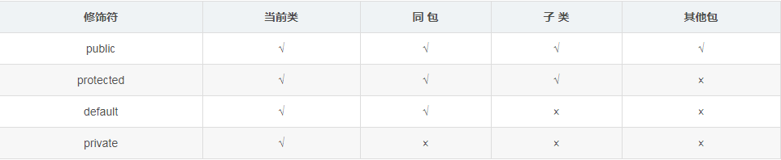

# 学习笔记

1. 面向对象的特征分为：抽象，继承，封装，多态性。  
   抽象是把对象的特征和行为等提取出来构造类；  
   继承是从一个类继承信息创建一个新类；  
   封装是只能通过指定的接口访问封装在类中的数据和对数据进行操作；  
   多态性就是用同样的对象引用调用同样的方法但是做了不同的事情。方法重载（overload）实现编译时的多态性（也称为前绑定），而方法重写（override）实现运行时的多态性（也称为后绑定）。运行时的多态是面向对象最精髓的东西，要实现多态需要做两件事：1). 方法重写（子类继承父类并重写父类中已有的或抽象的方法）；2). 对象造型（用父类型引用引用子类型对象，这样同样的引用调用同样的方法就会根据子类对象的不同而表现出不同的行为）。

2. 访问修饰符的区别
   
   类的成员不写访问修饰时默认为default。默认对于同一个包中的其他类相当于公开（public），对于不是同一个包中的其他类相当于私有（private）。受保护（protected）对子类相当于公开，对不是同一包中的没有父子关系的类相当于私有。Java中，外部类的修饰符只能是public或默认，类的成员（包括内部类）的修饰符可以是以上四种。

3. 数据类型  
   Java中的基本数据类型只有8个：byte、short、int、long、float、double、char、boolean；除了基本类型（primitive type），剩下的都是引用类型（reference type），Java 5以后引入的枚举类型也算是一种比较特殊的引用类型。

4. goto和const都是Java中的保留字，在目前版本的Java中没有使用。

5. 因为s1+= 1;相当于s1 = (含数据类型)(s1 + 1);其中有隐含的强制类型转换。

6. int和Integer的区别：通过自动装箱/拆箱机制让原始类型与包装类型进行互相转换。比较Integer对象引用，==运算比较的不是值而是引用，一个Integer对象仅能代表-128-127之间的int值，超过的要分别用对象指代。  
使用Integer a后面不加new对于-128<= x<=127的整数，将会直接缓存在IntegerCache中，那么当赋值在这个区间的时候，不会创建新的Integer对象，而是从缓存中获取已经创建好的Integer对象。当大于这个范围的时候，直接new Integer来创建Integer对象。  
存储在堆中，分配的地址不同，在使用==进行判读的时候，由于双方都是对象，所以比较对象的地址是不是相同，这里的地址是不同的，因为new的时候会在堆中重新分配存储空间。
去IntegerCache中取，既然都是去IntegerCache中去取，那么自然该对象应该是一个对象，那么在堆中的地址应该是一样的，所以在判读两个对象是不是== 的时候，会输出true。
  ```java
  class AutoUnboxingTest {

    public static void main(String[] args) {
        Integer a = new Integer(3);     // a为Integer对象引用，放在栈空间中，new新建一个Integer对象
        //放在堆空间中，3这个字面量放在方法区
        Integer b = 3;                  // 将3自动装箱成Integer类型，b为Integer对象引用
        //因为b在-128到127的范围内，不会创建新的对象，而是从IntegerCache中获取的。
        //那么Integer b = 128, 大于该范围的话才会直接通过new Integer（128）创建对象，进行装箱。
        int c = 3;
        System.out.println(a == b);     // false 两个引用没有引用同一对象
        System.out.println(a == c);     // true a自动拆箱成int类型再和c比较
    }
}
  ```

7. &运算符有两种用法：(1)按位与；(2)逻辑与。&&运算符是短路与运算，所以&&可以在左边为false时不判断右边的表达式。例如在验证用户登录时判定用户名不是null而且不是空字符串，应当写为：username != null &&!username.equals("")，二者的顺序不能交换，更不能用&运算符，因为第一个条件如果不成立，根本不能进行字符串的equals比较，否则会产生NullPointerException异常。注意：逻辑或运算符（|）和短路或运算符（||）的差别也是如此。

8. 内存中的栈(stack)、堆(heap)和方法区(method area)的用法：定义一个基本数据类型的变量，一个对象的引用，函数调用的现场保存都使用JVM中的栈空间；而通过new关键字和构造器创建的对象则放在堆空间，堆是垃圾收集器管理的主要区域，由于现在的垃圾收集器都采用分代收集算法，所以堆空间还可以细分为新生代和老生代，再具体一点可以分为Eden、Survivor（又可分为From Survivor和To Survivor）、Tenured；方法区和堆都是各个线程共享的内存区域，用于存储已经被JVM加载的类信息、常量、静态变量、JIT编译器编译后的代码等数据；程序中的字面量（literal）如直接书写的100、"hello"和常量都是放在常量池中，常量池是方法区的一部分。栈空间操作起来最快但是栈很小，通常大量的对象都是放在堆空间，栈和堆的大小都可以通过JVM的启动参数来进行调整，栈空间用光了会引发StackOverflowError，而堆和常量池空间不足则会引发OutOfMemoryError。  
  ```Java
  String str = new String("hello");
  ```  
  上面的语句中变量str放在栈上，用new创建出来的字符串对象放在堆上，而"hello"这个字面量是放在方法区的。

9. Math.round(11.5)的返回值是12，Math.round(-11.5)的返回值是-11。四舍五入的原理是在参数上加0.5然后进行下取整。

10. 3.4是双精度数，将双精度型（double）赋值给浮点型（float）属于下转型（down-casting，也称为窄化）会造成精度损失，因此需要强制类型转换float f =(float)3.4; 或者写成float f =3.4F;。

11. switch 是否能作用在byte 上，是否能作用在long 上，是否能作用在String上？  
在Java 5以前，switch(expr)中，expr只能是byte、short、char、int。从Java 5开始，Java中引入了枚举类型，expr也可以是enum类型，从Java 7开始，expr还可以是字符串（String），但是长整型（long）在目前所有的版本中都是不可以的。

12. 用最有效率的方法计算2乘以8？2 << 3（左移3位相当于乘以2的3次方，右移3位相当于除以2的3次方）。31 * num 等价于(num << 5) - num，左移5位相当于乘以2的5次方再减去自身就相当于乘以31，来产生哈希码（散列码）  
  ```Java
  @Override
    public int hashCode() {
        final int prime = 31;
        int result = 1;
        result = prime * result + areaCode;
        result = prime * result
                + ((lineNumber == null) ? 0 : lineNumber.hashCode());
        result = prime * result + ((prefix == null) ? 0 : prefix.hashCode());
        return result;
    }
  ```

13. 数组没有length()方法，有length 的属性。String 有length()方法。JavaScript中，获得字符串的长度是通过length属性得到的，这一点容易和Java混淆。

14. 在Java中，如何跳出当前的多重嵌套循环？ 在最外层循环前加一个标记如A，然后用break A;可以跳出多重循环。

15. 构造器（constructor）是否可被重写（override）？ 构造器不能被继承，因此不能被重写，但可以被重载。

16. 如果两个对象x和y满足x.equals(y) == true，它们的哈希码（hash code）应当相同。Java对于eqauls方法和hashCode方法是这样规定的：(1)如果两个对象相同（equals方法返回true），那么它们的hashCode值一定要相同；(2)如果两个对象的hashCode相同，它们并不一定相同。  
>首先equals方法必须满足自反性（x.equals(x)必须返回true）、对称性（x.equals(y)返回true时，y.equals(x)也必须返回true）、传递性（x.equals(y)和y.equals(z)都返回true时，x.equals(z)也必须返回true）和一致性（当x和y引用的对象信息没有被修改时，多次调用x.equals(y)应该得到同样的返回值），而且对于任何非null值的引用x，x.equals(null)必须返回false。  
实现高质量的equals方法的诀窍包括：1. 使用==操作符检查"参数是否为这个对象的引用"；2. 使用instanceof操作符检查"参数是否为正确的类型"；3. 对于类中的关键属性，检查参数传入对象的属性是否与之相匹配；4. 编写完equals方法后，问自己它是否满足对称性、传递性、一致性；5. 重写equals时总是要重写hashCode；6. 不要将equals方法参数中的Object对象替换为其他的类型，在重写时不要忘掉@Override注解。

17. String 类是final类，不可以被继承。对String类型最好的重用方式是关联关系（Has-A）和依赖关系（Use-A）而不是继承关系（Is-A）。

18. 当一个对象被当作参数传递到一个方法后，此方法可改变这个对象的属性，并可返回变化后的结果，那么这里是值传递还是引用传递？是值传递。Java语言的方法调用只支持参数的值传递。当一个对象实例作为一个参数被传递到方法中时，参数的值就是对该对象的引用。对象的属性可以在被调用过程中被改变，但对对象引用的改变是不会影响到调用者的。

19. Java平台提供了两种类型的字符串：String和StringBuffer/StringBuilder，它们可以储存和操作字符串。其中String是只读字符串，也就意味着String引用的字符串内容是不能被改变的。而StringBuffer/StringBuilder类表示的字符串对象可以直接进行修改。StringBuilder是Java 5中引入的，它和StringBuffer的方法完全相同，区别在于它是在单线程环境下使用的，因为它的所有方面都没有被synchronized修饰，因此它的效率也比StringBuffer要高  
  ```java
  public class StringEqualTest {
	  public static void main(String[] args) {
        String s1 = "Programming";//Sting是引用类型
        String s2 = new String("Programming");//new的对象放在堆空间，一般的引用对象放在栈空间
        String s3 = "Program";
        String s4 = "ming";
        String s5 = "Program" + "ming";
        String s6 = s3 + s4;
        System.out.println(s1 == s2);//false，两个引用对象不同
        System.out.println(s1 == s5);//true
        System.out.println(s1 == s6);//false
        System.out.println(s1 == s6.intern());//true，intern可以在运行期间将对象放入常量池中
        System.out.println(s2 == s2.intern());//false
    }
  }
  ```
  >1.String对象的intern方法会得到字符串对象在常量池中对应的版本的引用（如果常量池中有一个字符串与String对象的equals结果是true），如果常量池中没有对应的字符串，则该字符串将被添加到常量池中，然后返回常量池中字符串的引用；2. 字符串的+操作其本质是创建了StringBuilder对象进行append操作，然后将拼接后的StringBuilder对象用toString方法处理成String对象，这一点可以用javap -c StringEqualTest.class命令获得class文件对应的JVM字节码指令就可以看出来。

20. 方法的重载和重写都是实现多态的方式，区别在于前者实现的是编译时的多态性，而后者实现的是运行时的多态性。重载发生在一个类中，同名的方法如果有不同的参数列表（参数类型不同、参数个数不同或者二者都不同）则视为重载；重写发生在子类与父类之间，重写要求子类被重写方法与父类被重写方法有相同的返回类型，比父类被重写方法更好访问，不能比父类被重写方法声明更多的异常（里氏代换原则）。重载对返回类型没有特殊的要求。

21. 描述一下JVM加载class文件的原理机制？JVM中类的装载是由类加载器（ClassLoader）和它的子类来实现的，Java中的类加载器是一个重要的Java运行时系统组件，它负责在运行时查找和装入类文件中的类。当Java程序需要使用某个类时，JVM会确保这个类已经被加载、连接（验证、准备和解析）和初始化。类的加载是指把类的.class文件中的数据读入到内存中，通常是创建一个字节数组读入.class文件，然后产生与所加载类对应的Class对象。加载完成后，Class对象还不完整，所以此时的类还不可用。当类被加载后就进入连接阶段，这一阶段包括验证、准备（为静态变量分配内存并设置默认的初始值）和解析（将符号引用替换为直接引用）三个步骤。最后JVM对类进行初始化，包括：1)如果类存在直接的父类并且这个类还没有被初始化，那么就先初始化父类；2)如果类中存在初始化语句，就依次执行这些初始化语句。  
类的加载是由类加载器完成的，类加载器包括：根加载器（BootStrap）、扩展加载器（Extension）、系统加载器（System）和用户自定义类加载器（java.lang.ClassLoader的子类）。
>Bootstrap：一般用本地代码实现，负责加载JVM基础核心类库（rt.jar）；  
  Extension：从java.ext.dirs系统属性所指定的目录中加载类库，它的父加载器是Bootstrap；  
  System：又叫应用类加载器，其父类是Extension。它是应用最广泛的类加载器。它从环境变量classpath或者系统属性java.class.path所指定的目录中记载类，是用户自定义加载器的默认父加载器。

22. char类型可以存储一个中文汉字，因为Java中使用的编码是Unicode（不选择任何特定的编码，直接使用字符在字符集中的编号，这是统一的唯一方法），一个char类型占2个字节（16比特），所以放一个中文是没问题的。  
>补充：使用Unicode意味着字符在JVM内部和外部有不同的表现形式，在JVM内部都是Unicode，当这个字符被从JVM内部转移到外部时（例如存入文件系统中），需要进行编码转换。所以Java中有字节流和字符流，以及在字符流和字节流之间进行转换的转换流，如InputStreamReader和OutputStreamReader，这两个类是字节流和字符流之间的适配器类，承担了编码转换的任务；对于C程序员来说，要完成这样的编码转换恐怕要依赖于union（联合体/共用体）共享内存的特征来实现了。

23. 抽象类（abstract class）和接口（interface）有什么异同？  
抽象类和接口都不能够实例化，但可以定义抽象类和接口类型的引用。一个类如果继承了某个抽象类或者实现了某个接口都需要对其中的抽象方法全部进行实现，否则该类仍然需要被声明为抽象类。接口比抽象类更加抽象，因为抽象类中可以定义构造器，可以有抽象方法和具体方法，而接口中不能定义构造器而且其中的方法全部都是抽象方法。抽象类中的成员可以是private、默认、protected、public的，而接口中的成员全都是public的。抽象类中可以定义成员变量，而接口中定义的成员变量实际上都是常量。有抽象方法的类必须被声明为抽象类，而抽象类未必要有抽象方法。

24. 静态嵌套类(Static Nested Class)和内部类（Inner Class）的不同？  
Static Nested Class是被声明为静态（static）的内部类，它可以不依赖于外部类实例被实例化。而通常的内部类需要在外部类实例化后才能实例化，其语法看起来挺诡异的，如下所示:下面的代码哪些地方会产生编译错误？  
      ```java
    class Outer {

    class Inner {}

    public static void foo() { new Inner(); }

    public void bar() { new Inner(); }

    public static void main(String[] args) {
        new Inner();
    }
  }
  ```
  >注意：Java中非静态内部类对象的创建要依赖其外部类对象，上面的面试题中foo和main方法都是静态方法，静态方法中没有this，也就是说没有所谓的外部类对象，因此无法创建内部类对象，如果要在静态方法中创建内部类对象，可以这样做：
  ```Java
  new Outer().new Inner();
  ```

25. Java 中会存在内存泄漏吗，请简单描述:  
理论上Java因为有垃圾回收机制（GC）不会存在内存泄露问题（这也是Java被广泛使用于服务器端编程的一个重要原因）；然而在实际开发中，可能会存在无用但可达的对象，这些对象不能被GC回收，因此也会导致内存泄露的发生。例如Hibernate的Session（一级缓存）中的对象属于持久态，垃圾回收器是不会回收这些对象的，然而这些对象中可能存在无用的垃圾对象，如果不及时关闭（close）或清空（flush）一级缓存就可能导致内存泄露。下面例子中的代码也会导致内存泄露  
    ```java
    import java.util.Arrays;
    import java.util.EmptyStackException;

    public class MyStack<T> {
    private T[] elements;
    private int size = 0;

    private static final int INIT_CAPACITY = 16;

    public MyStack() {
        elements = (T[]) new Object[INIT_CAPACITY];
    }

    public void push(T elem) {
        ensureCapacity();
        elements[size++] = elem;
    }

    public T pop() {
        if(size == 0)
            throw new EmptyStackException();
        return elements[--size];
    }

    private void ensureCapacity() {
        if(elements.length == size) {
            elements = Arrays.copyOf(elements, 2 * size + 1);
        }
    }
    }
    ```
上面的代码实现了一个栈（先进后出（FILO））结构，乍看之下似乎没有什么明显的问题，它甚至可以通过你编写的各种单元测试。然而其中的pop方法却存在内存泄露的问题，当我们用pop方法弹出栈中的对象时，该对象不会被当作垃圾回收，即使使用栈的程序不再引用这些对象，因为栈内部维护着对这些对象的过期引用（obsolete reference）。在支持垃圾回收的语言中，内存泄露是很隐蔽的，这种内存泄露其实就是无意识的对象保持。如果一个对象引用被无意识的保留起来了，那么垃圾回收器不会处理这个对象，也不会处理该对象引用的其他对象，即使这样的对象只有少数几个，也可能会导致很多的对象被排除在垃圾回收之外，从而对性能造成重大影响，极端情况下会引发Disk Paging（物理内存与硬盘的虚拟内存交换数据），甚至造成OutOfMemoryError。

26. 抽象的（abstract）方法是否可同时是静态的（static）,是否可同时是本地方法（native），是否可同时被synchronized修饰？   
都不能。抽象方法需要子类重写，而静态的方法是无法被重写的，因此二者是矛盾的。本地方法是由本地代码（如C代码）实现的方法，而抽象方法是没有实现的，也是矛盾的。synchronized和方法的实现细节有关，抽象方法不涉及实现细节，因此也是相互矛盾的。

27. 静态变量和实例变量的区别:静态变量是被static修饰符修饰的变量，也称为类变量，它属于类，不属于类的任何一个对象，一个类不管创建多少个对象，静态变量在内存中有且仅有一个拷贝；实例变量必须依存于某一实例，需要先创建对象然后通过对象才能访问到它。静态变量可以实现让多个对象共享内存。在Java开发中，上下文类和工具类中通常会有大量的静态成员。

28. 是否可以从一个静态（static）方法内部发出对非静态（non-static）方法的调用？不可以，静态方法只能访问静态成员，因为非静态方法的调用要先创建对象，在调用静态方法时可能对象并没有被初始化。

29. 如何实现对象克隆？ 有两种方式：实现Cloneable接口并重写Object类中的clone()方法；实现Serializable接口，通过对象的序列化和反序列化实现克隆，可以实现真正的深度克隆，代码如下：  

  ```java
  import java.io.ByteArrayInputStream;
  import java.io.ByteArrayOutputStream;
  import java.io.ObjectInputStream;
  import java.io.ObjectOutputStream;
  import java.io.Serializable;

  public class MyUtil {

      private MyUtil() {
          throw new AssertionError();
      }

      @SuppressWarnings("unchecked")
      public static <T extends Serializable> T clone(T obj) throws Exception {
          ByteArrayOutputStream bout = new ByteArrayOutputStream();
          ObjectOutputStream oos = new ObjectOutputStream(bout);
          oos.writeObject(obj);

          ByteArrayInputStream bin = new ByteArrayInputStream(bout.toByteArray());
          ObjectInputStream ois = new ObjectInputStream(bin);
          return (T) ois.readObject();

          // 说明：调用ByteArrayInputStream或ByteArrayOutputStream对象的close方法没有任何意义
          // 这两个基于内存的流只要垃圾回收器清理对象就能够释放资源，这一点不同于对外部资源（如文件流）的释放
      }
  }
  ```
  然后写两个实现Serializable的实例Person和Car，测试结果如下：
  ```Java
    class CloneTest {

      public static void main(String[] args) {
          try {
              Person p1 = new Person("Hao LUO", 33, new Car("Benz", 300));
              Person p2 = MyUtil.clone(p1);   // 深度克隆
              p2.getCar().setBrand("BYD");
              // 修改克隆的Person对象p2关联的汽车对象的品牌属性
              // 原来的Person对象p1关联的汽车不会受到任何影响
              // 因为在克隆Person对象时其关联的汽车对象也被克隆了
              System.out.println(p1);
          } catch (Exception e) {
              e.printStackTrace();
          }
      }
  }
  ```
  >基于序列化和反序列化实现的克隆不仅仅是深度克隆，更重要的是通过泛型限定，可以检查出要克隆的对象是否支持序列化，这项检查是编译器完成的，不是在运行时抛出异常，这种是方案明显优于使用Object类的clone方法克隆对象。让问题在编译的时候暴露出来总是好过把问题留到运行时。

30. GC是什么？为什么要有GC？GC是垃圾收集的意思，内存处理是编程人员容易出现问题的地方，忘记或者错误的内存回收会导致程序或系统的不稳定甚至崩溃，Java提供的GC功能可以自动监测对象是否超过作用域从而达到自动回收内存的目的，Java语言没有提供释放已分配内存的显示操作方法。Java程序员不用担心内存管理，因为垃圾收集器会自动进行管理。要请求垃圾收集，可以调用下面的方法之一：System.gc() 或Runtime.getRuntime().gc() ，但JVM可以屏蔽掉显示的垃圾回收调用。  
垃圾回收可以有效的防止内存泄露，有效的使用可以使用的内存。垃圾回收器通常是作为一个单独的低优先级的线程运行，不可预知的情况下对内存堆中已经死亡的或者长时间没有使用的对象进行清除和回收，程序员不能实时的调用垃圾回收器对某个对象或所有对象进行垃圾回收。  
垃圾回收机制有很多种，包括：分代复制垃圾回收、标记垃圾回收、增量垃圾回收等方式。标准的Java进程既有栈又有堆。栈保存了原始型局部变量，堆保存了要创建的对象。Java平台对堆内存回收和再利用的基本算法被称为标记和清除，但是Java对其进行了改进，采用“分代式垃圾收集”。这种方法会跟Java对象的生命周期将堆内存划分为不同的区域，在垃圾收集过程中，可能会将对象移动到不同区域：伊甸园（Eden）,幸存者乐园（Survivor）,终身颐养园（Tenured）。

31. String s = new String("xyz");创建了几个字符串对象？  
两个对象，一个是静态区的"xyz"，一个是用new创建在堆上的对象。

32. 接口可以继承（extends）接口，而且支持多重继承。抽象类可以实现(implements)接口，抽象类可继承具体类也可以继承抽象类。

33. 一个".java"源文件中是否可以包含多个类（不是内部类）？有什么限制？  
可以，但一个源文件中最多只能有一个公开类（public class）而且文件名必须和公开类的类名完全保持一致。

34. Anonymous Inner Class(匿名内部类)是否可以继承其它类？是否可以实现接口？  
可以继承其他类或实现其他接口，在Swing编程和Android开发中常用此方式来实现事件监听和回调。

35. 内部类可以引用它的包含类（外部类）的成员吗？有没有什么限制？  
一个内部类对象可以访问创建它的外部类对象的成员，包括私有成员。

36. Java 中的final关键字有哪些用法？  
(1)修饰类：表示该类不能被继承；(2)修饰方法：表示方法不能被重写；(3)修饰变量：表示变量只能一次赋值以后值不能被修改（常量）。

37. 看代码说结果：A类静态类和构造器分别输出1和2，B类继承A类，B类静态类和构造器分别输出a和b
  ```java
  public class Hello {

      public static void main(String[] args) {
          A ab = new B();
          ab = new B();
      }

  }
  ```
执行结果：1a2b2b。创建对象时构造器的调用顺序是：先初始化静态成员，然后调用父类构造器，再初始化非静态成员，最后调用自身构造器。如果不能给出此题的正确答案，说明之前第21题Java类加载机制还没有完全理解，赶紧再看看吧。

38. 数据类型之间的转换：字符串与基本数据类型之间如何转化？  
调用基本数据类型对应的包装类中的方法parseXXX(String)或valueOf(String)即可返回相应基本类型；一种方法是将基本数据类型与空字符串（""）连接（+）即可获得其所对应的字符串；另一种方法是调用String 类中的valueOf()方法返回相应字符串。

39. 如何实现字符串的反转及替换？  
方法很多，可以自己写实现也可以使用String或StringBuffer/StringBuilder中的方法。有一道很常见的面试题是用递归实现字符串反转，代码如下所示：意思是每次都把第一个字符单独取出来放到最后，对前面的所有字符串进行递归，所以每次原来的字符串长度都会减一（因为代码中递归的部分始终是原来的字符串，而这个字符串在每次递归之后都会减少第0位的字符），到最后剩下一个的时候返回原来的字符串就是想要的字符串。
```java
public static String reverse(String originStr) {
        if(originStr == null || originStr.length() <= 1)
            return originStr;
        return reverse(originStr.substring(1)) + originStr.charAt(0);
    }
```

40. 怎样将GB2312编码的字符串转换为ISO-8859-1编码的字符串？
```java
String s1 = "你好";
String s2 = new String(s1.getBytes("GB2312"), "ISO-8859-1");
```

41. 日期和时间： 如何取得年月日、小时分钟秒？ 如何取得从1970年1月1日0时0分0秒到现在的毫秒数？ 如何取得某月的最后一天？ 如何格式化日期？  
创建java.util.Calendar 实例，调用其get()方法传入不同的参数即可获得参数所对应的值。Java 8中可以使用java.time.LocalDateTime来获取，代码如下所示。
  ```Java
  public class DateTimeTest {
      public static void main(String[] args) {
          Calendar cal = Calendar.getInstance();
          System.out.println(cal.get(Calendar.YEAR));
          System.out.println(cal.get(Calendar.MONTH));    // 0 - 11
          System.out.println(cal.get(Calendar.DATE));
          System.out.println(cal.get(Calendar.HOUR_OF_DAY));
          System.out.println(cal.get(Calendar.MINUTE));
          System.out.println(cal.get(Calendar.SECOND));

          // Java 8
          LocalDateTime dt = LocalDateTime.now();
          System.out.println(dt.getYear());
          System.out.println(dt.getMonthValue());     // 1 - 12
          System.out.println(dt.getDayOfMonth());
          System.out.println(dt.getHour());
          System.out.println(dt.getMinute());
          System.out.println(dt.getSecond());
      }
  }
  ```
  以下方法均可获得该毫秒数。  
```java
Calendar.getInstance().getTimeInMillis();  
System.currentTimeMillis();  
Clock.systemDefaultZone().millis(); // Java 8
```
  取得某月最后一天。
```Java
Calendar time = Calendar.getInstance();
time.getActualMaximum(Calendar.DAY_OF_MONTH);
```
利用java.text.DataFormat 的子类（如SimpleDateFormat类）中的format(Date)方法可将日期格式化。Java 8中可以用java.time.format.DateTimeFormatter来格式化时间日期，代码如下所示。
  ```java
  import java.text.SimpleDateFormat;
  import java.time.LocalDate;
  import java.time.format.DateTimeFormatter;
  import java.util.Date;

  class DateFormatTest {

      public static void main(String[] args) {
          SimpleDateFormat oldFormatter = new SimpleDateFormat("yyyy/MM/dd");
          Date date1 = new Date();
          System.out.println(oldFormatter.format(date1));

          // Java 8
          DateTimeFormatter newFormatter = DateTimeFormatter.ofPattern("yyyy/MM/dd");
          LocalDate date2 = LocalDate.now();
          System.out.println(date2.format(newFormatter));
      }
  }
  ```

42. 打印昨天的当前时刻。
  ```Java
  import java.util.Calendar;

  class YesterdayCurrent {
      public static void main(String[] args){
          Calendar cal = Calendar.getInstance();
          cal.add(Calendar.DATE, -1);
          System.out.println(cal.getTime());
      }
  }
  ```
  在java 8中可以使用如下代码实现相同的功能。
  ```Java
    import java.time.LocalDateTime;

  class YesterdayCurrent {

      public static void main(String[] args) {
          LocalDateTime today = LocalDateTime.now();
          LocalDateTime yesterday = today.minusDays(1);

          System.out.println(yesterday);
      }
  }
  ```
