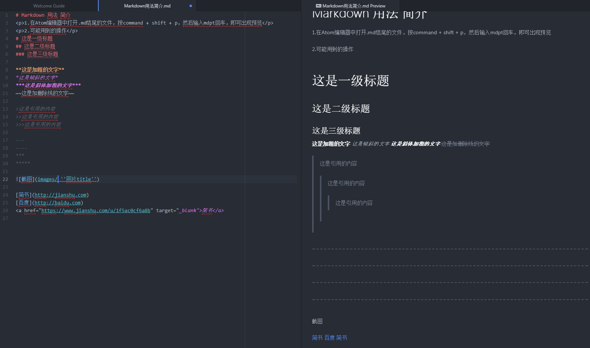

# Markdown 用法 简介
<p>1.在Atom编辑器中打开.md结尾的文件，按command + shift + p，然后输入mdpt回车，即可出现预览</p>
<p>2.可能用到的操作</p>
# 这是一级标题
## 这是二级标题
### 这是三级标题

**这是加粗的文字**
*这是倾斜的文字*
***这是斜体加粗的文字***
~~这是加删除线的文字~~

>这是引用的内容
>>这是引用的内容
>>>这是引用的内容

---
----
***
*****




[简书](http://jianshu.com)
[百度](http://baidu.com)
<a href="https://www.jianshu.com/u/1f5ac0cf6a8b" target="_blank">简书</a>

- 列表内容
+ 列表内容
* 列表内容

1. 列表内容
2. 列表内容
3. 列表内容

1. 列表1

   内容
2. 列表2

   内容
3. 列表3

   内容

姓名|技能|排行
--|:--:|--:
刘备|哭|大哥
关羽|打|二哥
张飞|骂|三弟

`create database hero;`

```
    function fun(){
         echo "这是一句非常牛逼的代码";
    }
    fun();
```

流程图：仅仅支持简书中显示
```flow
st=>start: 开始
op=>operation: My Operation
cond=>condition: Yes or No?
e=>end
st->op->cond
cond(yes)->e
cond(no)->op
&```
